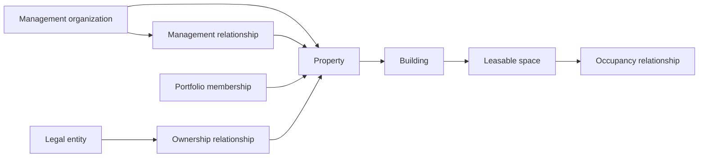

# Phase 2 Architecture

Classification: planning. See ADRs for accepted-when-approved decisions.

## Existing stack to preserve

| Layer | Current fact | Phase 2 disposition |
|---|---|---|
| Frontend | React 19, CRA, CRACO, React Router 7, Yarn 1.22.22, `frontend/yarn.lock` | Incremental refactor. Preserve public design, role-preview navigation, and Phase 0 routing fixes. |
| Backend | FastAPI 0.110.1, Pydantic 2.13.5, Motor/Mongo synthetic intake | FastAPI remains the process. Mongo stays for Phase 0 synthetic POST capture until a later retirement story. Reference persistence is PostgreSQL. |
| Contracts | `backend/foundation/` authoring; `python -m foundation.export`; `frontend/scripts/generate-contract-types.cjs` | One authoring authority. Evolve selected models to schema `0.2.0`. Do not hand-edit generated files. |
| Auth today | Role-preview URLs and `LoginModal`; `production_authorized=false` | Keep preview routes. Add separate local-authenticated persistent routes. |
| Database tooling | None (no Alembic, SQLAlchemy, docker-compose, or PostgreSQL) | Propose SQLAlchemy 2.0.x + Alembic + psycopg 3 + local PostgreSQL 16 or local Supabase. Do not install during planning. |
| Worker / queue | Contracts only (`OutboxRecord`, `InboxRecord`) | Same-repo worker process. No Kafka, Kubernetes, or workflow engine. |
| Package managers | Yarn only for frontend | No npm/pnpm/Bun lockfiles. No broad upgrades. |

## Proposed structure

Modular monolith inside this repository (`ADR-P2-001`):

```text
backend/foundation/          # contract authoring and Phase 0 export (reuse)
backend/perchpoint/          # new domain runtime (proposed)
  auth/                      # local synthetic sessions
  db/                        # engine, RLS context, restricted role
  domains/{org,property,listing,inquiry,activity}/
  commands/                  # explicit authorized commands
  events/                    # outbox/inbox types and publishers
  adapters/                  # fake provider + message sink
  workers/outbox_worker.py   # separately runnable
backend/alembic/             # proposed migrations
```

Eventual extraction path: each `domains/*` package already owns commands, repository
ports, and events. Do not split processes in Phase 2.

## Canonical model

Model separately:

1. Management organization.
2. Legal entities.
3. Effective-dated ownership and management relationships.
4. Portfolio or group membership.
5. Property.
6. Building.
7. Leasable space (common core; residential and commercial extensions).
8. Person and business contacts.
9. Household membership.
10. Authentication identity.
11. Lease/agreement and occupancy relationships (records only in Phase 2; no execution).
12. Provider references (`ExternalReference`).



Physical containment is `property → building → leasable space`. Ownership, portfolio
membership, and occupancy are relationships (`CONFLICT-008`). Mixed-use uses one
property with mixed allowed uses and per-space extensions. The existing Elm Court
upstairs-residential / downstairs-bakery fixture remains the conversion example.

One person may hold multiple organization roles. Authentication identity, household
membership, contractor affiliation, and private role data remain distinct. Do not
automatically merge identities across organizations.

Default resident portal access is one primary individual account. Additional adult
access requires explicit individual authorization. Never use shared household
passwords (`CONFLICT-010`, `PP-AUTH-010`, `PP-AUTH-009`).

Represent occupants, signers, payers, guarantors, minors, and authorized contacts
as distinct relationships.

Preserve historical relationships and existing canonical IDs from
`backend/foundation/seeds.py` (`NAMESPACE = 4db53964-11d0-428e-b0b2-ef23f1c63e89`).
A newer UUID strategy is not permission to regenerate those identifiers.

Use normalized addresses plus immutable snapshots when documents are later issued.
Use UTC instants with retained local time-zone context. Date-only lease terms remain
dates. Money remains `amount_minor` + ISO currency (`backend/foundation/base.py`).
No binary floating-point money.

One active HawkVision organization remains the operating org. Add a second
synthetic organization solely for negative isolation tests.

## Fixture extensions (synthetic)

Extend, do not replace, current seeds where practical:

- All approved property types (already present).
- Occupied, vacant, renovation, and archived states (add renovation/archived;
  map current `available`/`occupied` through CONFLICT-009).
- Mixed-use bakery conversion (already `Bakery C1` on Elm Court).
- Multiple jurisdictions (OH, KY, PA already present).
- Historical ownership and occupancy (new relationship rows; keep property IDs).
- Restricted worker assignments (existing maintenance/subcontractor people).
- Second organization (new org + inaccessible twins for deny tests).

## States and workflow ownership

Approved lifecycle labels are vocabulary. Each domain owns a transition graph.

Keep these space states separate (`CONFLICT-009`):

| State family | Examples | Writer |
|---|---|---|
| Condition | rent-ready, renovation, damaged | property command |
| Occupancy | vacant, occupied, notice | occupancy relationship |
| Availability | offerable, withheld | leasing command |
| Publication | unpublished, published, withdrawn | listing command |
| Maintenance restriction | none, limited-access, unsafe | later maintenance phase |
| Legal restriction | none, hold, litigation | later legal phase |

A household's displayed journey derives from its applications and leases. Application
denial or withdrawal is not an irreversible household-wide condition.

Actionable work has owner, status, next action, priority, deadline or SLA,
escalation, provenance, and history. Use domain state machines plus shared
task/approval/escalation contracts. Do not introduce a no-code workflow engine.

Administrators may later configure categories, thresholds, SLAs, assignments,
templates, office hours, and instructions. State-machine topology and financial
posting remain developer-controlled. Phase 2 ships read-only task/approval
projections only.

## Truth, correction, and privacy

PerchPoint owns operational workflow records. Provider facts about settlement,
screening, and signatures remain authoritative in their domains
(`docs/governance/SYSTEM_OF_RECORD_MAP.md`). Conflicts become visible
reconciliation exceptions. Neither side silently overwrites the other.

Derived values are not directly editable. Historical corrections require
attribution, reason, effective date, and preserved prior evidence.

Use domain-specific archival, anonymization, retention, and deletion. Provisional
retention must not auto-destroy records before approved review
(`RetentionPolicy.deletion_without_review = false`).

Classify data at field level. Minimize screening storage. Avoid raw government
identifiers and payment credentials through provider-hosted collection later.

Sensitive reads and exports require authorization and audit without copying
sensitive contents into logs (`PP-SEC-001`).
