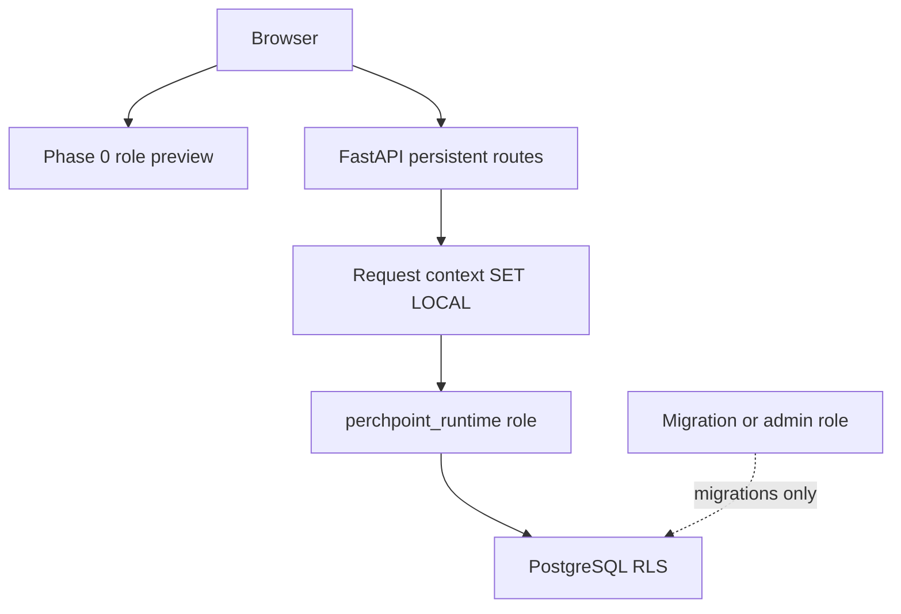

# Phase 2 Security and Threat Model

Classification: planning. Production identity remains later-phase (`PP-AUTH-011`).

## Trust boundary

A UI role, hidden control, client role header, or unverified organization
parameter is never authorization (`PP-AUTH-001`).

Protected persistent `/api/v2/*` routes require a verified local authenticated
actor. Phase 0 `/perchpoint/:roleId` and `LoginModal` remain synthetic preview
and must not grant write authority on persistent commands.

## Local synthetic identity

Phase 2 uses local-only synthetic identities and a message sink.

- No invitations or contact of actual stakeholders.
- No real email, SMS, or calendar delivery.
- Passwords, if used, are local test secrets in ignored env files only.
- Existing `bcrypt`, `passlib`, and `PyJWT` / `python-jose` may be reused; do
  not add a new identity vendor.

Full production identity, invitation, MFA, recovery, and delegation lifecycle
remain later (`PP-AUTH-002`, `PP-AUTH-011`).

## FastAPI-to-PostgreSQL contract

1. Authenticate the local session.
2. Load current membership from the database, not from the client.
3. Open a connection from a pool that uses `perchpoint_runtime`.
4. `SET LOCAL` transaction context: `app.actor_id`, `app.organization_id`,
   `app.request_id`.
5. Run the command transaction.
6. Reset or discard the connection so context cannot leak across checkout.

`perchpoint_runtime` has no table ownership, no `BYPASSRLS`, no superuser, and
no migration rights. Separate roles:

| Role | Use |
|---|---|
| `perchpoint_runtime` | API and worker |
| `perchpoint_migrator` | Alembic |
| `perchpoint_admin` | break-glass, never application pool |

Test policies directly as `perchpoint_runtime`, not only through an API that
connects as owner (`ADR-P2-002`).

## Public versus internal projections

Public listing routes expose explicit published projections: searchable listing
fields already implied by Platform Vision page 1. They never return internal
ownership, household, worker assignment, or audit rows.

## Threat model (reference slice)

| ID | Threat | Control in Phase 2 | Evidence |
|---|---|---|---|
| T-01 | Cross-organization read/write | Org membership + RLS | Direct DB + API deny tests |
| T-02 | Cross-property staff browse | Scope lists on membership | Scoped list/count tests |
| T-03 | Cross-household access | Household relationship required | Resident deny tests |
| T-04 | Worker assignment escape | Assignment-scoped policy | Worker fixture tests |
| T-05 | Forged role or org header | Ignore client role; session only | Header-forgery tests |
| T-06 | Expired or revoked scope | Membership/delegation expiry check | Time-frozen tests |
| T-07 | Missing actor context | Fail closed; no default org | Empty-context DB tests |
| T-08 | Pooled connection leakage | SET LOCAL + reset | Two-request pool tests |
| T-09 | Invalid cross-org FK | Composite org constraints | Migration constraint tests |
| T-10 | Field-level leakage | Projection allow-lists | Schema/serialization tests |
| T-11 | Search/count/pagination leakage | Same predicate as list | Count vs list equality |
| T-12 | Direct table access as runtime | RLS still denies | psql-as-runtime tests |
| T-13 | Preview role used as write auth | Separate routers | Command 401/403 from preview |
| T-14 | Idempotency key reuse with new payload | Conflict error | Command tests |
| T-15 | Stale version overwrite | expected_version | 409 tests |
| T-16 | Provider call in transaction | Forbidden by command runner | Static + unit guard |
| T-17 | Fake webhook forgery | HMAC + timestamp window | Inbox tests |
| T-18 | Out-of-order webhook | Version/idempotent inbox | Inbox tests |
| T-19 | Sensitive data in logs | Redaction filters | Log-capture tests |
| T-20 | Shared household password | Forbidden | Policy + provisioning tests |

## Future surfaces (not executable in Phase 2)

Provide controls and later acceptance cases only. Do not mark these passed.

| Surface | Residual threat | Future acceptance |
|---|---|---|
| Payments | Browser success treated as money | `PP-FIN-001` ledger vs processor vs settlement tests |
| Screening | Raw reports stored or autonomous decision | Counsel gate + `autonomous_decision=false` |
| E-sign | Unsigned packet treated as lease | Provider evidence vs operational record |
| Communications | Off-platform system of record | Capture + consent tests |
| Maintenance purchasing | Worker standing purchase | `PP-MAINT-002` deny tests |
| Production MFA | Shared or missing privileged MFA | `PP-AUTH-011` |
| AI | Autonomous housing/legal/money action | `PP-SEC-004` prohibited-action tests |

## Feature flags

Server-enforced flags may hide unfinished UI. They never replace authorization.
Phase 0 `PHASE0_ENABLED` and preview flags remain distinct from Phase 2
persistent-route flags.
